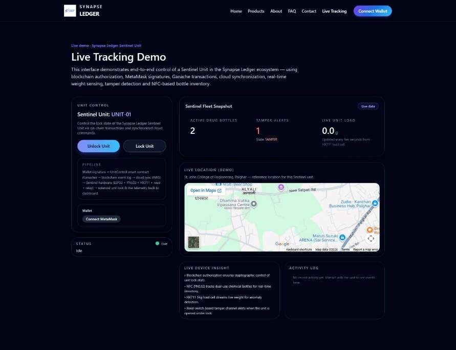

# Synapse Ledger – Blockchain Based IoT Sentinel Unit

> A secure, cyber-physical monitoring system for tracking dual-use chemical shipments in real time, combining IoT sensing with blockchain-based tamper-proof data storage.



**B.Tech Major Project — Electronics & Computer Science Engineering**
St. John College of Engineering and Management, Palghar (Autonomous, University of Mumbai) | 2025–2026

## Team

| Name | Roll No. |
|---|---|
| Sanjeev Sanjay Pathak | EU1227009 |
| Omkar Sadashiva Poojary | EU1227015 |
| Pranjal Kantilal Patil | EU1227052 |
| Vaishnav Sanjay Swami | EU1227020 |

**Guide:** Mrs. Shilpa Katre, Assistant Professor, ECS

## Overview

Dual-use precursor chemicals are essential to industry but vulnerable to diversion into illicit drug manufacturing. Existing tracking methods — paper records, barcodes, or plain GPS — offer no real-time visibility into a container's actual physical condition and are easy to tamper with or spoof.

**Synapse Ledger** solves this with the **Sentinel Unit**: an IoT device fitted to each shipment container that continuously monitors location, lid/breach status, shock and vibration, weight changes, and content authenticity (via NFC). Every reading is cryptographically signed at the source, transmitted securely, and written to a private blockchain — creating an immutable, verifiable digital twin of the physical shipment. A web dashboard gives regulators (e.g. the Narcotics Control Bureau) real-time visibility and instant tamper alerts.

## System Architecture
Sensors → ESP32-WROVER → ATECC608B (sign data) → GPS / LTE / Wi-Fi
↓
Node.js Backend (AWS)
↓
Private Ethereum Blockchain (Ganache)
↓
Web Dashboard (HTML/CSS/JS)

| Layer | Technology |
|---|---|
| Sensing | MPU-6050 (shock), magnetic reed switch (breach), HX711 load cell (weight), PN532 NFC, ultrasonic sensor, conductive mesh |
| Processing & Security | ESP32-WROVER, ATECC608B crypto co-processor |
| Communication | NEO-6M GPS, SIM A7672S LTE, Wi-Fi |
| Backend | Node.js, Amazon AWS |
| Blockchain | Private Ethereum network (Ganache, Remix IDE) |
| Frontend | HTML, CSS, JavaScript |

## Repository Structure
synapse-ledger/
├── firmware/ # ESP32 sensor + communication code (Arduino IDE, C/C++)
│ └── sentinel_unit/
├── backend/ # Node.js server — device comms, validation, blockchain bridge
│ ├── routes/
│ └── models/
├── blockchain/ # Smart contracts + private Ethereum network setup
│ ├── contracts/
│ └── migrations/
├── dashboard/ # Web dashboard for live tracking, alerts, history
│ ├── css/
│ └── js/
└── docs/ # Full project report, diagrams, references

## Key Features

- **Real-time GPS tracking** of shipment location
- **Multi-parameter tamper detection** — lid breach, shock/vibration, weight discrepancy, content mismatch
- **Hardware-level cryptographic signing** of every data packet at the source
- **Immutable blockchain ledger** — tamper-evident, timestamped audit trail
- **Live web dashboard** with alerts and historical logs for regulatory authorities

## Hardware Requirements

See [`docs/`](./docs) for the full component list and datasheets. Core components: ESP32-WROVER, ATECC608B, NEO-6M GPS, SIM A7672S LTE, MPU-6050, HX711 load cell, PN532 NFC reader, 18650 Li-Ion battery.

## Software Setup

```bash
# Backend
cd backend
npm install
npm start

# Blockchain (local dev network)
npm install -g ganache
ganache

# Dashboard
# Open dashboard/index.html in a browser, or serve with any static server
```

Firmware is flashed to the ESP32 via the Arduino IDE — see [`firmware/sentinel_unit/`](./firmware/sentinel_unit).

## Documentation

The complete project report — literature review, requirement analysis, design diagrams (use case, class, activity, sequence, DFD), Gantt chart, testing, results, and future scope — is available in [`docs/`](./docs).

## Future Scope

- AI/ML-based predictive anomaly detection
- Edge computing for offline tamper detection
- Additional environmental sensors (temperature, humidity, gas)
- Blockchain interoperability (Ethereum mainnet, Hyperledger, Polygon)
- Mobile app for field officers

## License

This project is submitted in partial fulfilment of the requirements for the degree of Bachelor of Technology, University of Mumbai. See [LICENSE](./LICENSE) for reuse terms.
